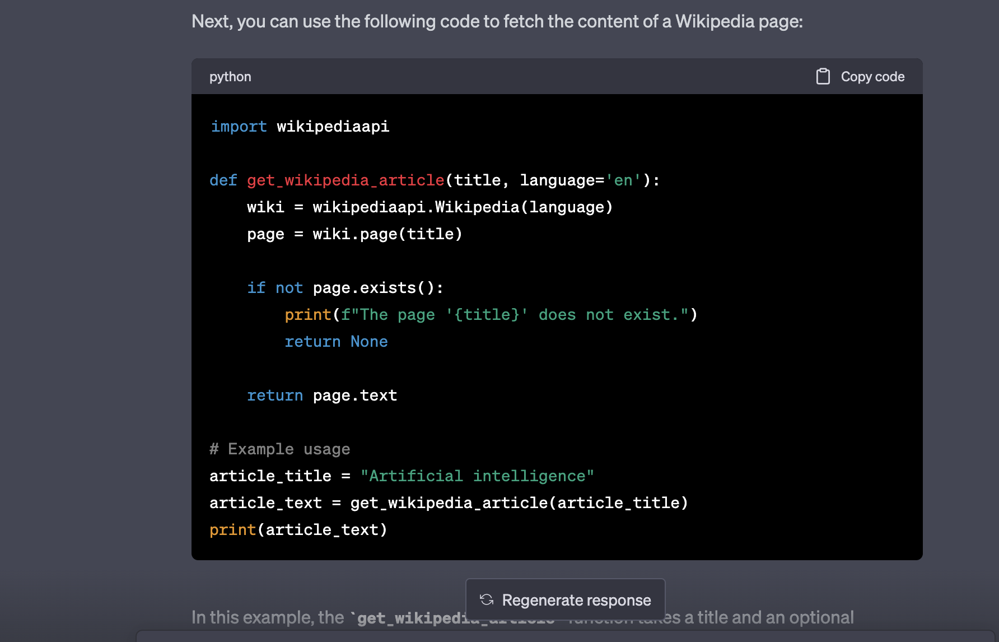
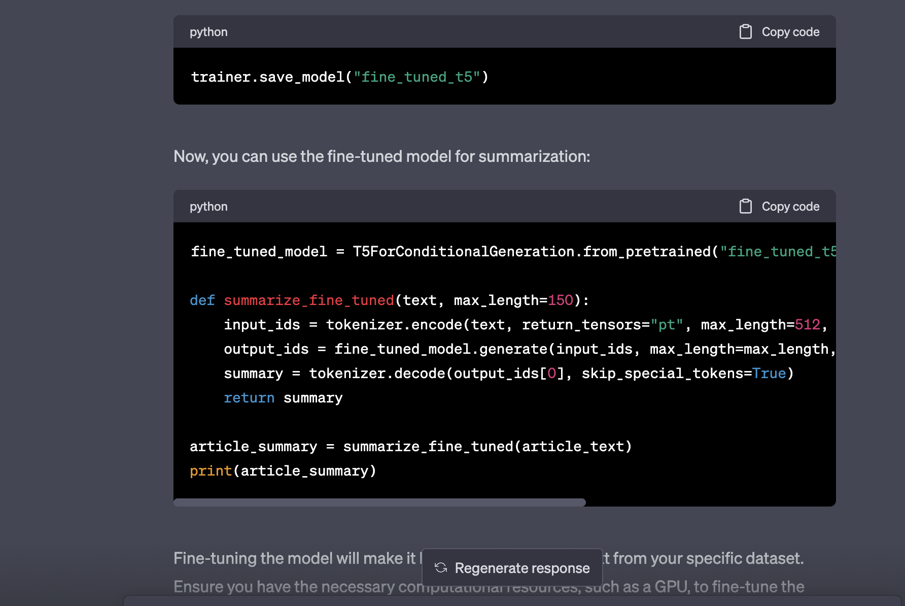

# Text Summarization Project

## 1. Project Overview

In this project, I used Wikipedia as my primary data source and leveraged the Wikipedia Python library to fetch articles. I employed the T5 transformer model to process and analyze the text data, aiming to create a text summarization tool that reduces long articles to a more digestible length.

## 2. Implementation

My system architecture consists of several key components:

- Data fetching: Using the Wikipedia Python library, I fetched article text from Wikipedia pages.
- Text summarization: I utilized the T5 transformer model along with the Hugging Face Transformers library to perform text summarization.
- Fine-tuning: I fine-tuned the T5 model using the CNN/Daily Mail dataset to improve the summarization quality.

One design decision I faced was whether to use an extractive or abstractive summarization technique. I chose the T5 model, which employs an abstractive technique, because it generates more coherent and concise summaries by generating new text.

I used ChatGPT to help understand how to work with the Wikipedia API and fetch data from Wikipedia.

## 3. Results

My text summarization tool was successful in generating concise summaries of various Wikipedia articles. Here's an example of a summary for the "Quantum Computing" article:

"Quantum computing is an area of computing focused on developing computer-based technologies centered around the principles of quantum theory. Quantum computers use quantum bits, or qubits, which can represent both 0 and 1 simultaneously. This enables quantum computers to solve certain problems much faster than classical computers. However, building and maintaining a large-scale quantum computer remains challenging due to qubit decoherence and other technical difficulties."

## 4. Reflection

From a process perspective, the project progressed smoothly in terms of fetching data from Wikipedia and implementing the text summarization tool. However, there remains room for improvement in fine-tuning the model and evaluating its performance. Due to the large size of the CNN/Daily Mail dataset and the extensive computational requirements in terms of RAM and CPU power, I was unable to execute my optimization code. The project scope was appropriate, but incorporating a more robust testing plan would have been advantageous.

From a learning perspective, I gained valuable experience working with the T5 model, the Hugging Face Transformers library, and the Wikipedia API. ChatGPT played a helpful role in guiding me through various implementation steps and in exploring new tools and techniques. In hindsight, knowing more about different text summarization techniques and the limitations of the T5 model would have helped make better-informed decisions in the project.
